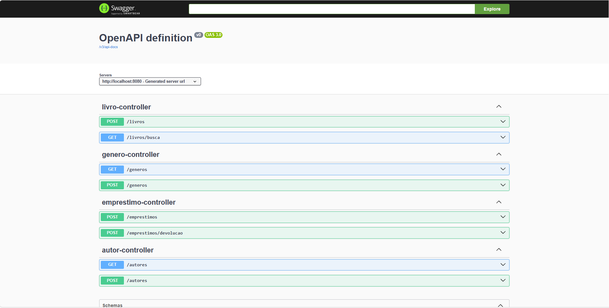

# 📚 Biblioteca Digital API
Este projeto é uma API robusta para gestão de biblioteca digital, desenvolvida com o objetivo de aplicar e consolidar conhecimentos avançados em **Spring Boot, Sistemas de Busca (NoSQL), Testes de Integração com Docker e Automação de Pipelines (CI/CD)**.

O sistema gerencia o ciclo completo de acervo e empréstimos, com diferenciais técnicos focados em performance e experiência do usuário, como uma **Fila de Espera automática** e **Busca Desnormalizada**.

# 🚀 Tecnologias e Ferramentas
- **Java 17** & **Spring Boot 3.4.1.**

- **PostgreSQL**: Banco de dados relacional para persistência transacional.

- **Elasticsearch**: Motor de busca de alta performance para consultas rápidas de livros e gêneros.

- **Testcontainers**: Uso de containers Docker reais para garantir a fidelidade dos testes de integração.

- **GitHub Actions**: Pipeline de CI/CD para execução automática de testes e builds a cada push.

- **Lombok**: Produtividade na criação de modelos.

- **SpringDoc OpenAPI (Swagger)**: Documentação interativa da API.

# 💡 Funcionalidades Principais
### 🔍 Busca Avançada com Elasticsearch
Diferente de buscas SQL tradicionais, o projeto utiliza o Elasticsearch para realizar pesquisas textuais complexas por **Título** e **Gênero**, garantindo respostas em milissegundos mesmo com grandes volumes de dados.

### ⏳ Fila de Espera Inteligente
Implementei uma lógica onde, se um livro for solicitado e estiver indisponível, o usuário não recebe apenas um erro, mas é **automaticamente inserido em uma fila de espera** ordenada por data de solicitação.

### 🔄 Empréstimo e Devolução Automática
Ao devolver um livro, o sistema verifica instantaneamente se há alguém na fila. Se houver, o livro não volta para a prateleira; ele é **imediatamente emprestado para o próximo usuário da fila**, otimizando o fluxo da biblioteca.

# 🧪 Estratégia de Testes
Um dos pilares deste projeto é a confiabilidade. Utilizo **Testcontainers** para subir instâncias reais do PostgreSQL e do Elasticsearch durante a execução dos testes. Isso elimina o problema comum de "testes que passam no H2 mas quebram no banco real".
- **Testes de Integração**: Validam o fluxo completo desde o Controller até a persistência final no banco e no índice de busca.

- **Smoke Tests**: Garantem que o contexto da aplicação sobe corretamente com todas as dependências de infraestrutura.

# 🛠️ Como Executar
O projeto está totalmente "dockerizado", facilitando o setup em qualquer ambiente.
1. Certifique-se de ter o **Docker** instalado.
2. Clone o repositório.
3. Na raiz do projeto, execute:
   ````
   docker-compose up --build
   ````
4. Acesse a documentação Swagger em:
   ````
   http://localhost:8080/swagger-ui/index.html
   ````
   
## 📖 Documentação da API (Swagger)

Abaixo está a interface do Swagger UI, onde pode testar os endpoints de livros, autores, géneros e empréstimos:



# 📈 Evolução e Aprendizados
Este projeto foi fundamental para eu dominar:
1. **Sincronização entre SQL e NoSQL**: Como manter o Elasticsearch atualizado conforme as mudanças no Postgres.
2. **Cultura DevOps**: Criação de pipelines CI/CD com GitHub Actions para garantir código sempre funcional.
3. **Desenvolvimento Orientado a Testes**: Implementação de fluxos de negócio complexos validados por testes automatizados.
